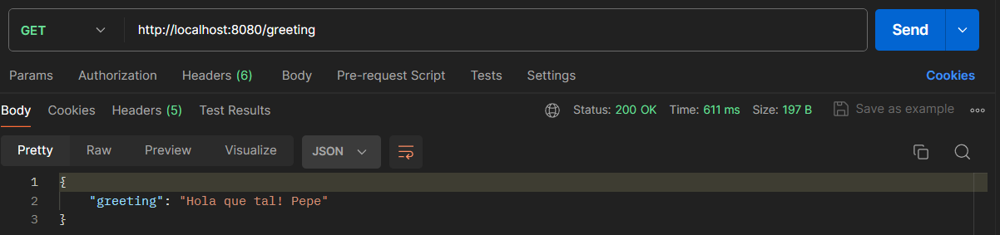
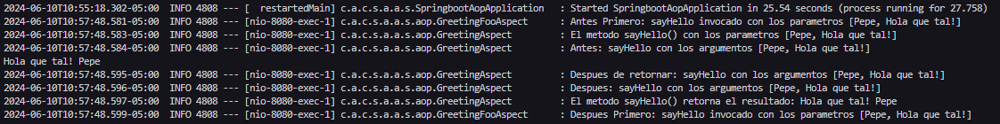
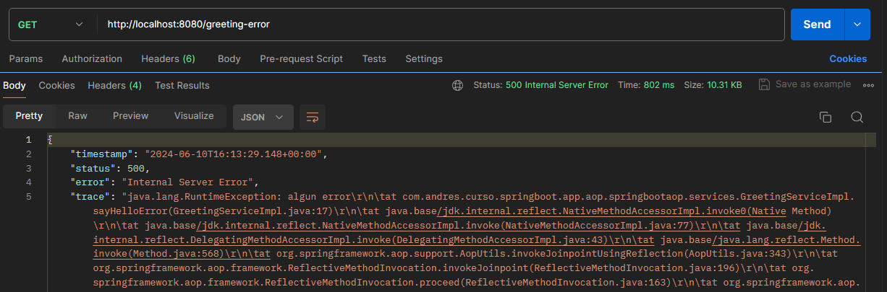
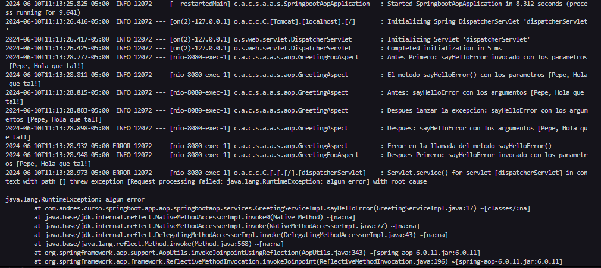

# Programacion Orientada Aspectos
## Descripción del proyecto

Crear un aspecto que intercepte el metodo del service para envolver 
con algun un tipo logg(funcionalidad extra).


## Recursos

El proyecto esta creado con las siguientes tecnologías, las primeras 3 se obtienen
al momento de crear el proyecto.


| Plugin                |
|-----------------------|
| Spring Web            | 
| Spring Boot DevTools  | 
| Spring Boot Actuator  | 


## Implementacion

1. Agregar dependencia en `pom.xml`.

```java
<dependency>
			<groupId>org.springframework.boot</groupId>
			<artifactId>spring-boot-starter-aop</artifactId>
</dependency>
```

2. Crear un aspecto para el registro de metodos.

```java
@Order(2)
@Aspect
@Component
public class GreetingAspect {
    // para registrar eventos
    private Logger logger = LoggerFactory.getLogger(this.getClass());

    @Before("GreetingServicePointcuts.greetingLoggerPointCut()")// metodo de la clase 
    public void loggerBefore(JoinPoint joinPoint) {
        //para registrar antes
        String method = joinPoint.getSignature().getName();
        String args = Arrays.toString(joinPoint.getArgs());
        logger.info("Antes: " + method + " con los argumentos " + args);
    }
    
    @After("GreetingServicePointcuts.greetingLoggerPointCut()")
    public void loggerAfter(JoinPoint joinPoint) {

        String method = joinPoint.getSignature().getName();
        String args = Arrays.toString(joinPoint.getArgs());
        logger.info("Despues: " + method + " con los argumentos " + args);
    }
    
    @AfterReturning("GreetingServicePointcuts.greetingLoggerPointCut()")//no maneja excepciones
    public void loggerAfterReturningr(JoinPoint joinPoint) {

        String method = joinPoint.getSignature().getName();
        String args = Arrays.toString(joinPoint.getArgs());
        logger.info("Despues de retornar: " + method + " con los argumentos " + args);
    }
    
    @AfterThrowing("GreetingServicePointcuts.greetingLoggerPointCut()")
    public void loggerAfterThrowing(JoinPoint joinPoint) {

        String method = joinPoint.getSignature().getName();
        String args = Arrays.toString(joinPoint.getArgs());
        logger.info("Despues lanzar la excepcion: " + method + " con los argumentos " + args);
    }
    
    @Around("GreetingServicePointcuts.greetingLoggerPointCut()")
    public Object loggerAround(ProceedingJoinPoint joinPoint) throws Throwable{
        String method = joinPoint.getSignature().getName();
        String args = Arrays.toString(joinPoint.getArgs());

        Object result = null;
        try {
            logger.info("El metodo " + method + "() con los parametros " + args);
            result = joinPoint.proceed();
            logger.info("El metodo " + method + "() retorna el resultado: " + result);
            return result;
        } catch (Throwable e) {
            logger.error("Error en la llamada del metodo " + method + "()");
            throw e;
        }

    }
}
```

```java
@Order(1)
@Component
@Aspect
public class GreetingFooAspect {
    private Logger logger = LoggerFactory.getLogger(getClass());

    @Before("GreetingServicePointcuts.greetingFooLoggerPointCut()")
    public void loggerBefore(JoinPoint joinPoint) {

        String method = joinPoint.getSignature().getName();
        String args = Arrays.toString(joinPoint.getArgs());
        logger.info("Antes Primero: " + method + " invocado con los parametros " + args);
    }
    
    @After("GreetingServicePointcuts.greetingFooLoggerPointCut()")
    public void loggerAfter(JoinPoint joinPoint) {

        String method = joinPoint.getSignature().getName();
        String args = Arrays.toString(joinPoint.getArgs());
        logger.info("Despues Primero: " + method + " invocado con los parametros " + args);
    }
}
```

```java
@Aspect
@Component
public class GreetingServicePointcuts {
    
    @Pointcut("execution(* com.franco.curso.springboot.app.aop.springbootaop.services.GreetingService.*(..))")
    public void greetingLoggerPointCut() {
    }
    
    @Pointcut("execution(* com.franco.curso.springboot.app.aop.springbootaop.services.GreetingService.*(..))")
    public void greetingFooLoggerPointCut() {
    }
}
```

3. Crear un controlador REST

```java
@RestController
public class GreetingController {
    
    @Autowired
    private GreetingService greetingService;

    @GetMapping("/greeting")
    public ResponseEntity<?> greeting() {
        return ResponseEntity.ok(Collections.singletonMap("greeting", greetingService.sayHello("Pepe", "Hola que tal!")));
    }
    @GetMapping("/greeting-error")
    public ResponseEntity<?> greetingError() {
        return ResponseEntity.ok(Collections.singletonMap("greeting", greetingService.sayHelloError("Pepe", "Hola que tal!")));
    }
}
```


## Uso de Postman

Enviar una solicitud **GET** 

```sh
http://localhost:8080/greeting
```



Luego verificar el terminal




**GET**

```sh
http://localhost:8080/greeting-error
```



Verifiando el error



## Resumen

Hemos creado un ejemplo sencillo de cómo usar la programación orientada a aspectos en Java con Spring para registrar la ejecución de métodos. Configuramos un aspecto que intercepta todas las ejecuciones de métodos en los controladores y registra su nombre después de su ejecución. Probamos la aplicación usando Postman y verificamos los registros en la consola.